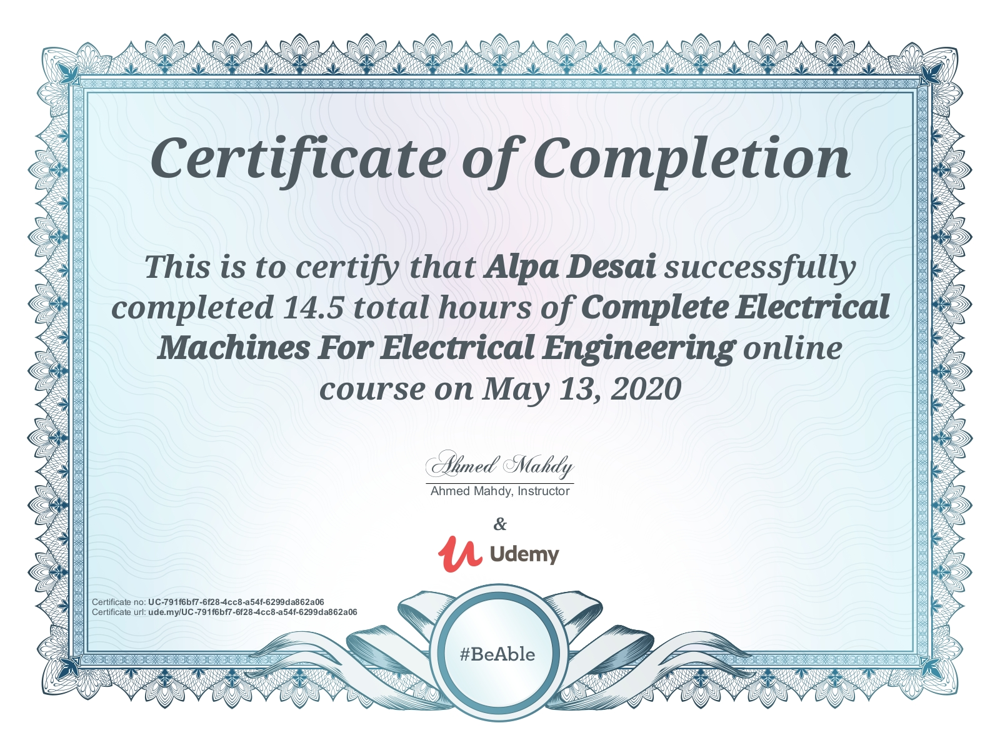
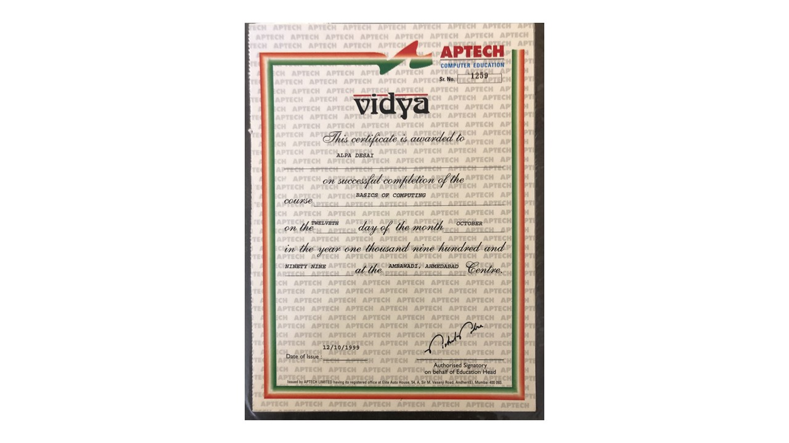

# Electrical Machine Design

The project provides an introduction to electrical machine design with microcontrollers
Confidential information is not displayed. 

Please download the executable in https://github.com/alpaddesai/ElectricalMachineDesign/releases for details.

All images are either custom by Alpa D Desai or a reference name is included.

Most of the images are custom. 

## DC Machines

## Basics of Computing

Further details on applications reference : https://github.com/alpaddesai/IndustrialRoboticAutomation
